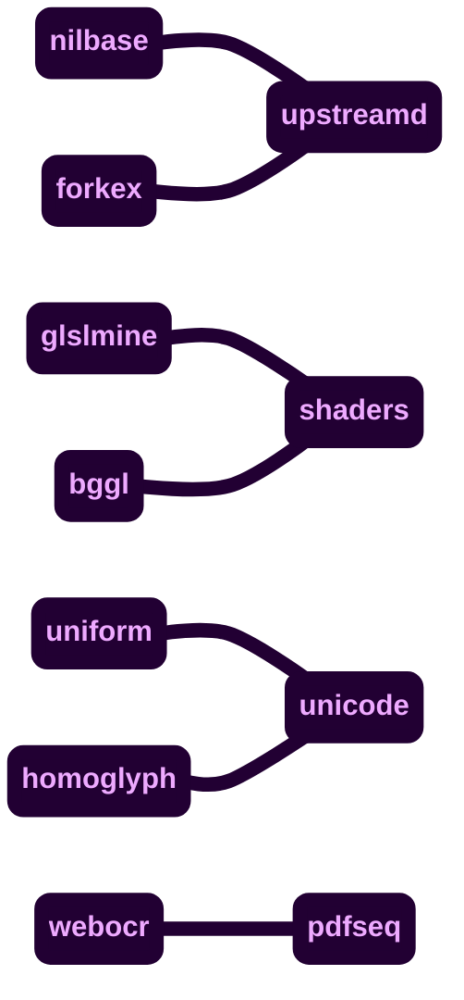

  

---

  

     
  

```mermaid
---
config:
  theme: base
  flowchart:
    curve: cardinal
    shape: stadium
    padding: 4
  themeVariables:
    lineColor: "#220033"
    primaryColor: "#220033"
    primaryBorderColor: "#220033"
    primaryTextColor: "#EEAAFF"
---
flowchart RL
  umd(upstreamd)
  unf(uniform)
  hmm(homoglyph)
  gls(shaders)
  glm(glslmine)
  fkx(forkex)
  nil(nilbase)
  uni(unicode)
  bggl(bggl)
  pdfseq(pdfseq)
  webocr(webocr)
  umd --- nil
  gls --- glm
  gls --- bggl
  umd --- fkx
  uni --- unf
  uni --- hmm
  pdfseq --- webocr

  classDef default stroke-width:8px,font-weight:bold;
  linkStyle default stroke-width:8px;
```

---

  

     
  

  PLACEHOLDER

  

     
  

  PLACEHOLDER

<!-- shaders uniform deadzone nilbase glslmine glslmine vite forkex slide.gl xyz.gl nilx -->
